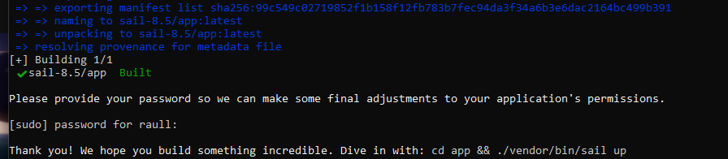
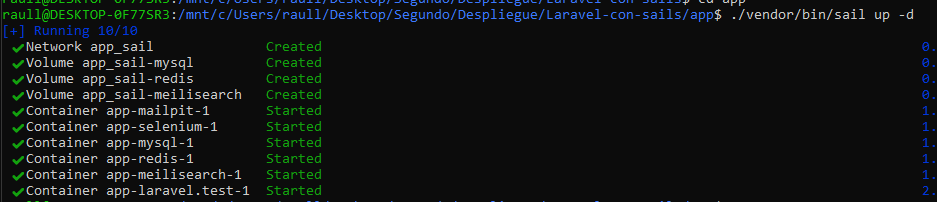
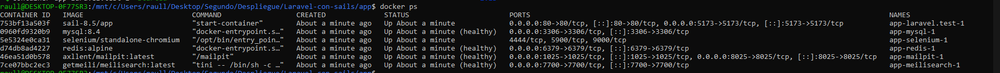
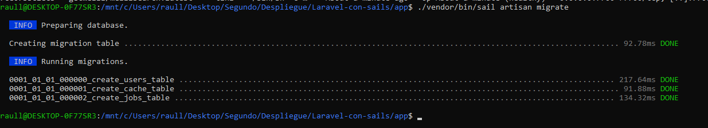
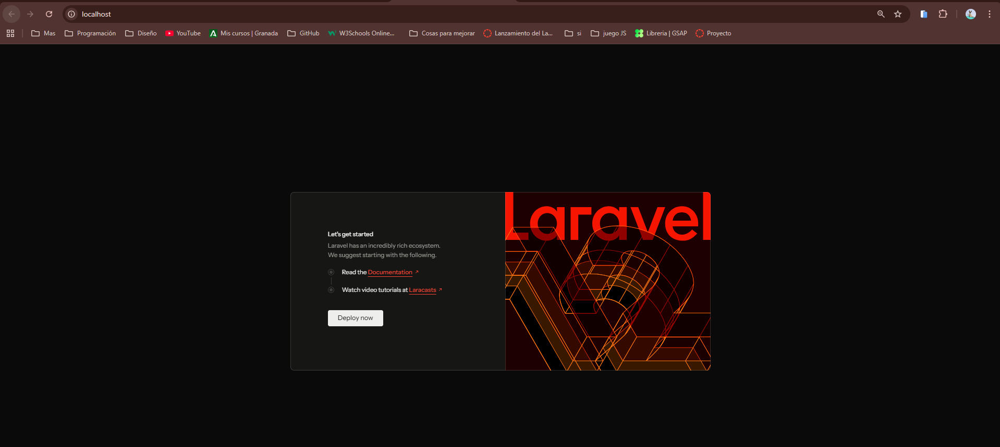
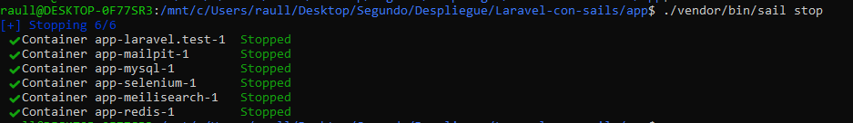
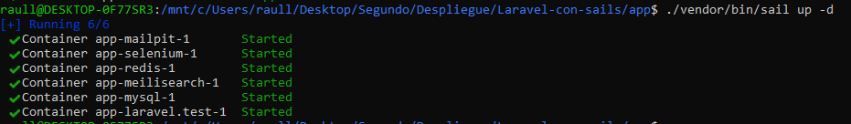
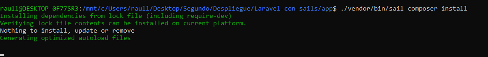
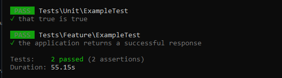

# Laravel-con-sails
## Requisitos
Necesitamos tener Docker Desktop, no solo instalado además lo tenemos que tener en ejecución, además una terminal de comandos y por último en mi caso wsl2

## Creación
Primero tenemos que abrir la terminal pero de wsl2, para poder ejectuar el curl, ya que en windows funciona de otra forma, por tanto lo primero es ubicarnos en la carpeta correcta

Ahora ejecutamos el comando `curl -s "https://laravel.build/app" | bash` para crear nuestro proyecto.
Y ahora toca esperar ya que la instalación es bastante lenta.

## Configuración de Laravel Sail
Primero nos saldrá un mensaje pidiendo la contraseña para el usuario, en mi caso para raull, que es mi usuario del ordenador y luego nos dará el mensaje de instalación correcta.

Ahora solo tenemos que acceder al directorio que se ha creado al ejecutar el comando anterior, que en mi caso es `app`, entonces simplemente ejecutamos es `cd app` y ahora tendremos que iniciar el entorno de contenedores por primera vez, con el comando `./vendor/bin/sail up -d`. 

El mensaje mostrado en la terminal es el siguiente:

## Gestión de servicios
Como indica el archivo "Laravel Sail configura automáticamente un stack completo" por tanto para verlos vamos a ejecutar el comando `docker ps` y nos mostrará los servicios que están corriendo, los cuales son los siguientes: 

## Ejecución de Migraciones y Pruebas
Una vez que tenemso todo activo vamos a preparar la base de datos y verificar el acceso al framework.
Empezamos con el comando `./vendor/bin/sail artisan migrate`
Que nos devuelve la siguiente respuesta:

Y si todo ha salido bien tenemos que irnos en el navegador a `http://localhost` y nos tiene que mostrar la página de bienvenida de Laravel.

## Comandos de mantenimiento
Vamos a ir ejecutando los comandos propuestos para ver que todo funciona de manera correcta.
- Detener los contenedores: `/vendor/bin/sail stop`

- Iniciar los contenedores: `/vendor/bin/sail up -d`

- Ejecutar comandos de Composer: `	/vendor/bin/sail composer install`

- Ejectutar test unitarios: `/vendor/bin/sail test`
