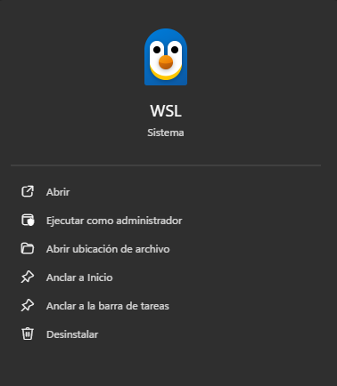
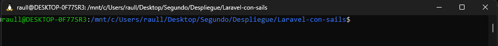

# Laravel-con-sails
## Requisitos
Necesitamos tener Docker Desktop, no solo instalado además lo tenemos que tener en ejecución, además una terminal de comandos y por último en mi caso wsl2

## Creación
Primero tenemos que abrir la terminal pero de wsl2, para poder ejectuar el curl, ya que en windows funciona de otra forma, por tanto lo primero es ubicarnos en la carpeta correcta

Ahora ejecutamos el comando `curl -s "https://laravel.build/app" | bash` para crear nuestro proyecto.
Y ahora toca esperar ya que la instalación es bastante lenta.